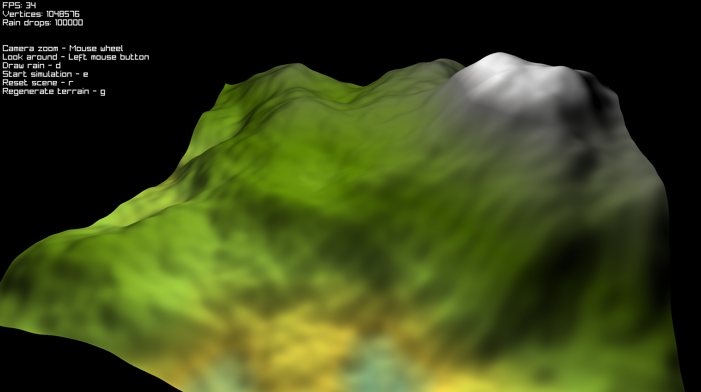
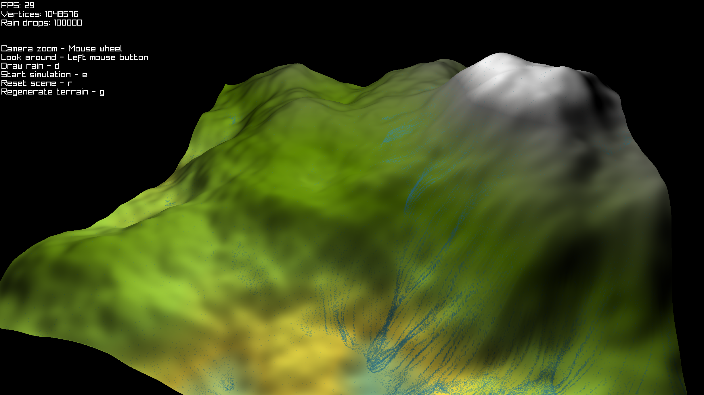
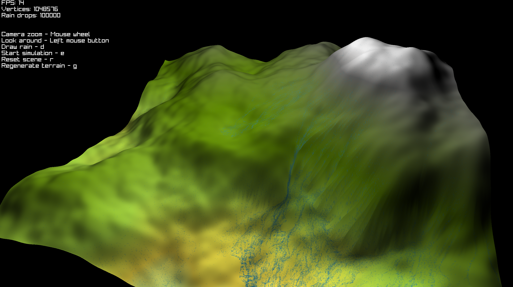
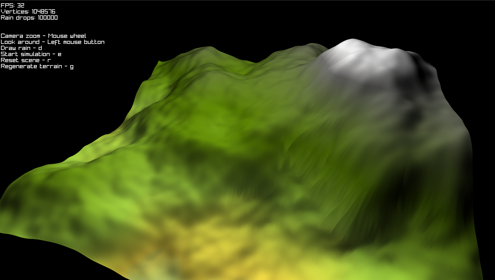

# Erosion Simulation

The aim of the project was to practice numerical and computational methods, by creating an application focused on solving differential equations.

The application simulates the process of erosion on proceduraly generated terrain due to the force of moving water droplets.

## Contents
- [Erosion Simulation](#erosion-simulation)
  - [Contents](#contents)
  - [Build \& Run](#build--run)
    - [Building the application](#building-the-application)
    - [Running the application](#running-the-application)
  - [Computational methods](#computational-methods)
  - [Examples](#examples)
  - [Sources](#sources)


## Build & Run
The project is implemented in C++20, using:
* Raylib v5.6 - rendering and window management
* Raymath v2.0 - vector and math utilities
* FastNoiseLite 1.1.1 - procedural noise generation
* CMake - build system
* Docker - reproducible build environment
* Python 3 - Build and run orchestration scripts

To avoid manual dependency installation on the host system, the entire build process is encapsulated inside a Docker image.

### Building the application
To build the project, run:
```bash
./tools/build.py
```

The script will:
* automatically setup docker image with all of the necessary dependencies
* compile the code inside the container and export it to the *build* directory on host machine

### Running the application
After a successful build, the application can be launched with:
```bash
./tools/run.py
```

## Computational methods
The path of the droplets moving downhill is calculated using the [gradient descent](https://en.wikipedia.org/wiki/Gradient_descent) algorithm:

$$
{\displaystyle \mathbf {x} _{n+1}=\mathbf {x} _{n}-\eta _{n}\nabla f(\mathbf {x} _{n}),\ n\geq 0}
$$

where:

$$
  \nabla f = 
  \left[
      \begin{array}{c}
          \dfrac{\partial f}{{\partial x}} \\\\
          \dfrac{\partial f}{{\partial y}} \\\\
          \dfrac{\partial f}{{\partial z}} \\\\
      \end{array}
  \right]
$$

The droplet position in world space is represented by a time-dependent function, describing its motion over the terrain surface.

The droplet is influenced by gravity acting along the terrain slope and by a drag force proportional to its velocity.
The total force acting on the droplet is defined as:

$$
F_{total} = F_{gravity} + F_{drag}
$$

The gravitational force is given by:

$$
\begin{aligned}
F_{gravity} &= m \cdot a \\
F_{gravity} &= -m \cdot g \cdot \nabla h(x, z) \\
\end{aligned}
$$

where $\nabla h(x, z)$ denotes the gradient of the terrain height field.

The drag force is modeled as linear velocity damping:

$$
F_{drag} = -v \cdot \eta_{drag}
$$

Combining both forces yields the total force acting on the droplet:

$$
F_{total} = -m \cdot g \cdot \nabla h(x, z) -v \cdot \eta_{drag}
$$

Velocity and acceleration are defined as time derivatives of the position function:

$$
\begin{aligned}
v &= \frac {df}{dt} \\
a &= \frac {dv}{dt} = \frac{d^2f}{dt^2}
\end{aligned}
$$

Substituting these definitions into Newton’s second law:

$$
\begin{aligned}
F_{total} &= m \cdot a \\
-m \cdot g \cdot \nabla h(x, z) &-\frac{df}{dt} \cdot \eta_{drag} = m \cdot \frac{d^2f}{dt^2} \\
\\
\end{aligned}
$$

To simplify numerical integration, the second-order differential equation is rewritten as a system of two first-order equations:

$$
\begin{aligned}
-m \cdot g \cdot \nabla &h(x, z) -v \cdot \eta_{drag} = m \cdot \frac{dv}{dt} \\
\\
I: \frac{df}{dt} &= v \\
II: \frac{dv}{dt} &= -g \cdot \nabla h(x, z) -\frac{v \cdot \eta_{drag}}{m}
\end{aligned}
$$

This system is numerically integrated using a fourth-order [Runge–Kutta method](https://en.wikipedia.org/wiki/Runge%E2%80%93Kutta_methods) (RK4):

$$
\begin{aligned}
\frac {dy}{dt} &= f(t, y) \\
y(t_0) &= y_0
\end{aligned}
$$

$$
\begin{aligned}
y_{n + 1} &= y_n + \frac {h}{6} (k_1+2k_2+2k_3+k_4) \\
t_{n + 1} &= t_n + h
\end{aligned}
$$

$$
\begin{aligned}
k_1 &= f(t_n , y_n) \\
k_2 &= f(t_n + \frac {h}{2}, y_n + h\frac {k_1}{2}) \\
k_3 &= f(t_n + \frac {h}{2}, y_n + h\frac {k_2}{2}) \\
k_4 &= f(t_n + h, y_n + hk_3)
\end{aligned}
$$

where $h$ is the integration time step.

## Examples
 
 
 


## Sources
1. https://www.firespark.de/resources/downloads/implementation%20of%20a%20methode%20for%20hydraulic%20erosion.pdf
2. https://catlikecoding.com/unity/tutorials/procedural-meshes/creating-a-mesh/
3. https://bartwronski.com/2021/02/28/computing-gradients-on-grids-forward-central-and-diagonal-differences/
4. https://medium.com/@ivo.thom.vanderveen/improved-terrain-generation-using-hydraulic-erosion-2adda8e3d99b
5. https://www.youtube.com/watch?v=4RpVBYW1r5M
